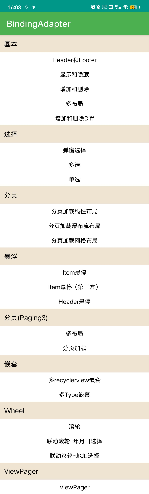
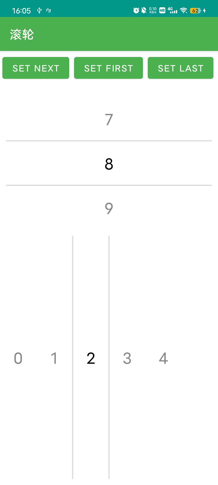
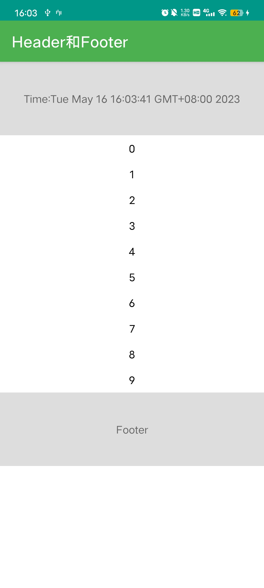
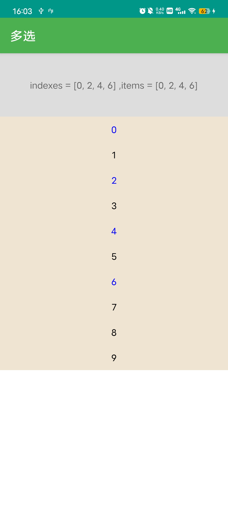
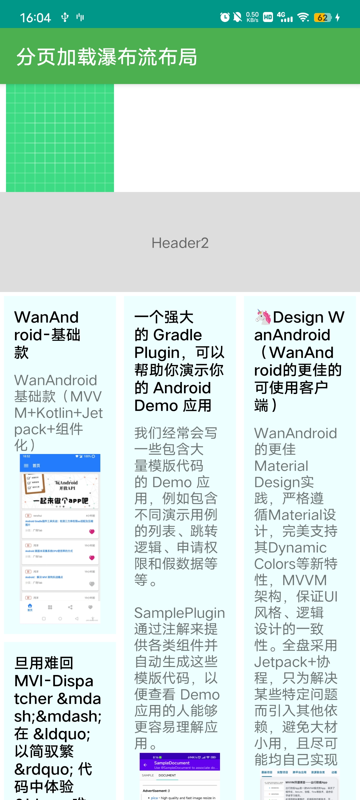
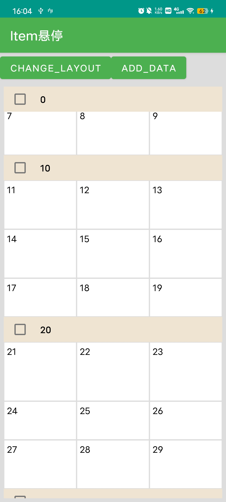
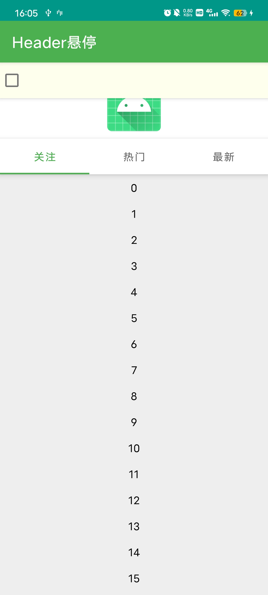
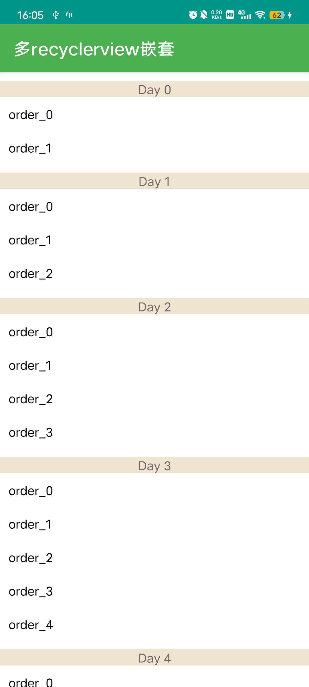
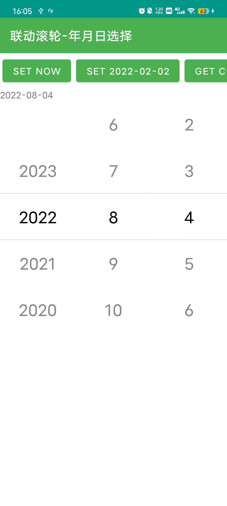
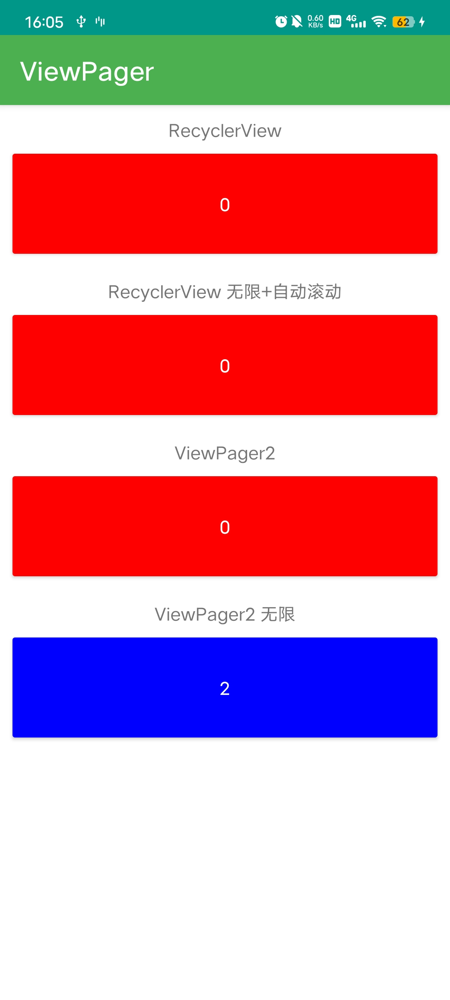

# 使用ViewBinding Adapter

<p align="center">

<a href="https://github.com/ve3344/BindingAdapter/blob/master/LICENSE"></a>
<a href="https://jitpack.io/#ve3344/BindingAdapter"></a>
</p>

❤ BindingAdapter是一个使用ViewBinding 直接生成RecyclerView Adapter的库，避免创建Adapter类和ViewHolder类。减少80%的代码。

不同于其他对RecyclerView的封装，该库十分精简，核心只有约500行代码，其他模块通过拓展的方式实现。

并通过AOP的思想解耦了分页模块，选择模块，悬浮模块，等等，使BindingAdapter核心类保持精简，且各个模块自己相互独立。

所有的功能均能在示例中找到。 项目地址[BindingAdapter](https://github.com/ve3344/BindingAdapter)

# 特点

- 无需创建ViewHolder类和Adapter类

- 使用ViewBinding操作View，再也不需要R.id.xxx以及findViewById，支持DataBinding绑定数据

- 支持任意位置添加Header和Footer (无侵入)

- 支持Item布局的点击事件，长按事件，Item子布局元素点击事件

- 支持通过Class/或者自定义类别快速配置多布局，避免繁琐的viewType

- 快速配置分页加载模块，支持Paging3,添加加载状态的Footer,空数据布局等

- 支持下拉刷新/SwipeRefreshLayout

- 支持ViewPager2，无限数据、自动滚动等

- 快速配置支持滚轮模块，支持多滚轮联动（年月日联动，省市区联动等）

- 快速配置Item悬浮模块，支持头布局悬浮

- 快速配置Item单选，多选模块

- 支持折叠和展开Adapter数据，控制一组数据的显示和隐藏，支持完全隐藏item，解决itemView设置GONE 占用布局位置的问题

- 强大的拓展性和自由度，引入模块无需修改Adapter，RecyclerView，能添加各种监听，拦截，拓展模块等

- 不依赖任何第三方库，轻量，无反射，极简的设计，所见即所得

# 集成

#### 添加仓库

```groovy
//in build.gradle(Project)
allprojects {
    repositories {
        maven { url 'https://jitpack.io' }
    }
}

// 新版方式 settings.gradle
dependencyResolutionManagement {
    repositories {
        maven { url 'https://jitpack.io' }
    }
}
```

#### 添加依赖

[](https://jitpack.io/#ve3344/BindingAdapter)

```groovy
//in build.gradle(module)
dependencies {
    //核心类
    implementation "com.github.ve3344.BindingAdapter:binding-adapter:2.1.0"
    //动态加载 分页模块
    implementation "com.github.ve3344.BindingAdapter:binding-adapter-loadmore:2.1.0"
    //常用拓展模块，单选，多选，WheelView，粘性Item，ViewPager无限数据等
    implementation "com.github.ve3344.BindingAdapter:binding-adapter-modules:2.1.0"
    //paging3分页模块
    implementation "com.github.ve3344.BindingAdapter:binding-adapter-paging:2.1.0"
}
```

#### 项目开启ViewBinding

```groovy
//in build.gradle(module)
android {
    //...
    buildFeatures {
        viewBinding = true
        dataBinding = true //可选
    }
}
```

# 使用

## 普通Adapter

```kotlin
//in XxxActivity.ky
val adapter = BindingAdapter<ItemBean, ItemBinding>(ItemBinding::inflate) { position, item ->
    //在绑定器内，配置对ui元素和bean属性之间的绑定，设置点击事件等。
    itemBinding.title.text = item.title
    itemBinding.title.setOnClickListener {

    }
}
//adapter.addData(...)//添加数据
//adapter.replaceData(...)//替换数据
```

## 多布局Adapter

```kotlin
val adapter = buildMultiTypeAdapterByType {
    layout<String, ItemSimpleTitleBinding>(ItemSimpleTitleBinding::inflate) { _, item ->
        itemBinding.title.text = item
    }
    layout<Date, ItemSimpleBinding>(ItemSimpleBinding::inflate) { _, item ->
        itemBinding.title.text = item.toString()
    }
}
```

## 添加Header

```kotlin
val header = SingleViewBindingAdapter(HeaderSimpleBinding::inflate)
val adapter =
    header + BindingAdapter<ItemBean, ItemBinding>(ItemBinding::inflate) { position, item ->
        //在绑定器内，配置对ui元素和bean属性之间的绑定，设置点击事件等。
        itemBinding.title.text = item.title
        itemBinding.title.setOnClickListener {

        }
    }

```

更多使用方式见文档

## [文档](https://github.com/ve3344/BindingAdapter/wiki)


# 预览


|   |                                                                                                  |  |
|------------------------|-----------------------------------------------------------------------------------------------------------------------|-----------------------|
|   |                                                                                                  |  |
|   |                                                                                                  |  |
|  |   [Demo下载](https://raw.githubusercontent.com/ve3344/BindingAdapter/master/app/release/app-release.apk)  |  |


## 感谢

[玩Android Api](https://wanandroid.com/)

[StickyHeaderScrollView](https://github.com/kongnanlive/StickyHeaderScrollView)

# License

``` license
 Copyright 2021, ve3344@qq.com 
  
   Licensed under the Apache License, Version 2.0 (the "License");
   you may not use this file except in compliance with the License.
   You may obtain a copy of the License at 
 
       http://www.apache.org/licenses/LICENSE-2.0 

   Unless required by applicable law or agreed to in writing, software
   distributed under the License is distributed on an "AS IS" BASIS,
   WITHOUT WARRANTIES OR CONDITIONS OF ANY KIND, either express or implied.
   See the License for the specific language governing permissions and
   limitations under the License.
```