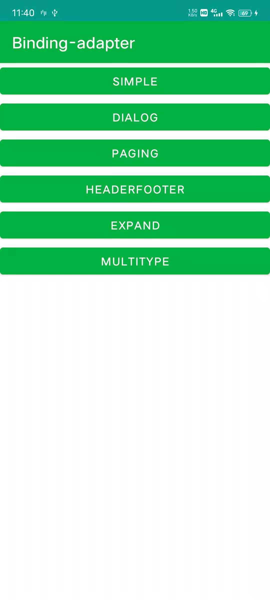
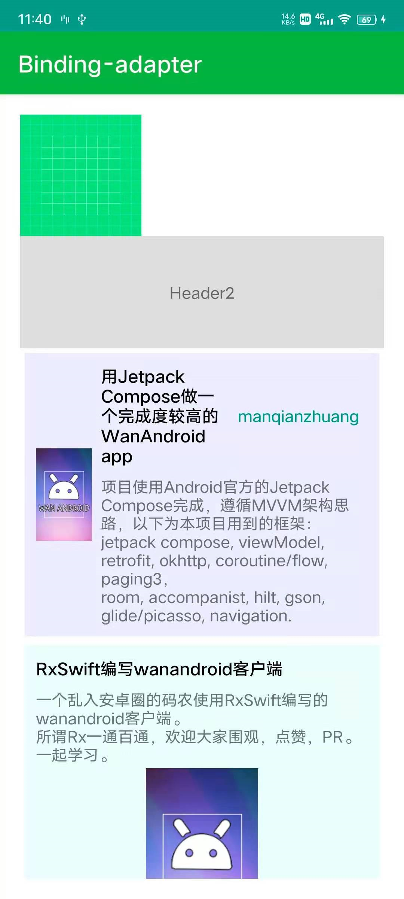
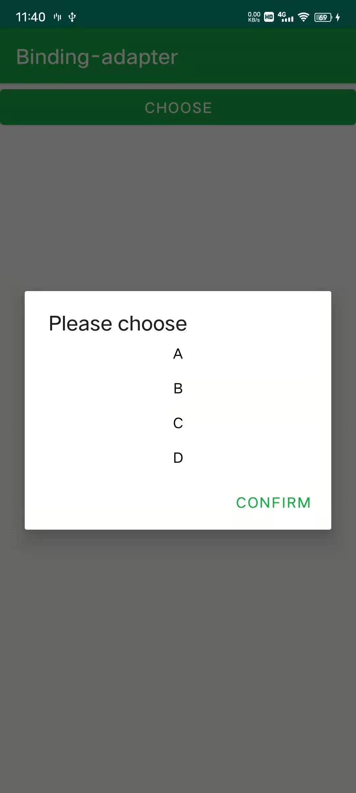
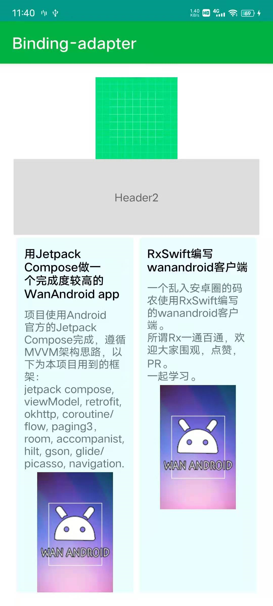

# 使用ViewBinding Adapter

[](https://jitpack.io/#ve3344/binding-adapter)

  ❤ 一个使用ViewBinding 直接生成RecyclerView Adapter的库。

- 无需创建ViewHolder，无需创建Adapter

- 直接操作View，再也不需要View id以及findViewById

- 支持ViewBinding、DataBinding

- 支持下拉刷新

- 支持Item的点击事件监听

- 支持添加任意Header和Footer

- 支持多布局配置

- 支持Paging3下拉加载更多

- 支持添加加载状态（加载中、无更多数据、加载失败、加载完成）

- 支持加载失败点击重试

- 支持没有数据时显示空布局

- 支持折叠和展开items

- 支持隐藏item(不占用布局位置)

- 支持GirdLayoutManager

- 强大的拓展性和自由度

- 不依赖任何第三方库，轻量（方法数<40，体积<23kb）

- 无反射

- 极简的设计，所见即所得

# 预览




# 安装

#### 添加仓库

```groovy
//in build.gradle(Project)
allprojects {
    repositories {
        maven { url 'https://jitpack.io' }
    }
}

// 新版方式 settings.gradle
dependencyResolutionManagement {
    repositories {
        maven { url 'https://jitpack.io' }
    }
}
```

#### 添加依赖

```groovy
//in build.gradle(module)
dependencies {
    //core
    implementation "com.github.ve3344.binding-adapter:binding-adapter:1.0.0"
    //paging support
    implementation "com.github.ve3344.binding-adapter:binding-adapter-paging:1.0.0"
}
```
# 相关文章

[使用binding-adapter告别新建Adapter和ViewHolder](BLOG_BASE.md)

[ConcatAdapter和GridLayoutManager同时使用的问题](BLOG_GIRD.md)

[使用ViewBinding 简化RecyclerView多布局](BLOG_MULTI_TYPE.md)

[使用ObservableList代替自动adapter.notifyXXXX刷新列表](BLOG_NOTIFY.md)

[结合Paging3 快速添加下拉刷新](BLOG_SWIPE_REFRESH.md)

# 简单示例

更多使用方式见Demo

#### 基本使用

```kotlin
val list = listOf(
    PageItemBean("Simple", MutableActivity::class.java),
    PageItemBean("Dialog", DialogSelectActivity::class.java),
    PageItemBean("Paging", PagingActivity::class.java),
    PageItemBean("HeaderFooter", HeaderFooterActivity::class.java),
    PageItemBean("Expand", ExpandActivity::class.java),
    PageItemBean("MultiType", MultiTypeActivity::class.java),
)
val adapter = BindingAdapter(ItemPageBinding::inflate, list) { position, item ->
    binding.title.text = item.title
    binding.title.setOnClickListener {
        startActivity(Intent(this@MainActivity, item.clz))
    }
}
```

#### 添加Header和Footer

```kotlin
val header = SingleViewBindingAdapter(HeaderSimpleBinding::inflate)
val footer = SingleViewBindingAdapter(FooterSimpleBinding::inflate)

binding.list.adapter = header + adapter + footer
```

#### 控制元素折叠和展开

```kotlin
adapter.isVisible = isChecked
```

#### 配置多布局

使用MultiTypeAdapterUtils.createConfig创建多布局配置，

然后生成Adapter 或 PagingAdapter

```kotlin
val adapter = MultiTypeAdapterUtils.createConfig<ProjectBean> {
    //配置item到布局类型的映射(必须)
    extractItemViewType { position, item ->
        //type要求从0开始，并且连续
        position % 2 //根据position 分别映射0，1
    }

    //layout按顺序 匹配type

    //type=0
    layout(ItemProject2Binding::inflate) { _, item: ProjectBean ->
        binding.vm = item
        binding.executePendingBindings()
    }

    //type=1
    layout(ItemProjectBinding::inflate) { _, item: ProjectBean ->
        binding.vm = item
        binding.executePendingBindings()
    }

}.asPagingAdapter()
//使用asPagingAdapter 或asAdapter 把多布局配置转换为adapter

```

#### 使用下拉刷新

使用 SwipeRefreshLayout 可参照 SwipeRefreshLayoutExt.kt

```kotlin
binding.list.wrapSwipeRefresh(adapter)

```

#### 自动刷新列表

Adapter本身不带观察数据刷新，如果需要可参照OnListChangedNotifier

```kotlin
list.addOnListChangedCallback(OnListChangedNotifier(adapter))
binding.add.setOnClickListener {
    list.add("${Date()}")
    //自动刷新列表数据
}
```

#### 结合Paging3

在给PagingDataAdapter添加header等时，可使用rearrange拓展进行重新配置（或自己使用ConcatAdapter拼接） 可以添加任意个header/footer

对加载状态进行监听 

对空数据状态进行监听

```kotlin
fun PagingDataAdapter<*, *>.configPagingWithHeader(): ConcatAdapter {
    //重新对Adapter进行依次拼接
    return rearrange() {
        //添加 header
        layoutContent(VirtualViewBindingInflater { parent, _, _ -> ImageView(parent.context) }::inflate) {
            binding.contentView.setImageResource(R.drawable.ic_launcher_background)
        }
        //添加 header
        layoutContent(HeaderProjectBinding::inflate) {
            binding.tips.text = "Header2"
        }
        //添加分页内容
        pagingContent()
        //添加加载状态
        loadStateContent(FooterProjectBinding::inflate) { loadState ->
            loadState.onIdle {
                //空闲，隐藏所有view
                binding.root.showChildOnly { false }
            }.onLoading {
                //加载中，显示加载中
                binding.root.showChildOnly { it == binding.progressBar }
            }.onEnd {
                //没有更多数据了，显示没有更多数据
                binding.root.showChildOnly { it == binding.reachEnd }
            }.onError {
                //加载失败，显示加载失败、
                binding.root.showChildOnly { it == binding.loadError }
                binding.loadError.setOnClickListener {
                    //点击重试
                    retry()
                    binding.root.showChildOnly { it == binding.progressBar }
                    //手动显示加载中
                }
            }
        }
        //添加数据空布局（数据为空时显示）
        emptyStateContent(LayoutEmptyBinding::inflate)
        //添加footer
        layoutContent(HeaderProjectBinding::inflate) {
            binding.tips.text = "Footer1"
        }
    }
}

```

#### 使用 GridLayoutManager

本身可直接兼容GridLayoutManager 

如果希望Header/Footer/LoadStateLayout/EmptyLayout单独占据一行,

可重新设置SpanSizeLookup (提供configSingleViewSpan拓展)

```kotlin
binding.list.layoutManager = GridLayoutManager(this, 2).apply {
    configSingleViewSpan {
        //当子adapter 是PagingDataAdapter 时按GirdLayout排列
        //其它adapter 按单行排列
        adapter.getAdapterByItemPosition(it) !is PagingDataAdapter<*, *>
    }
}
```


# License

``` license
 Copyright 2021, luowenbin 
  
   Licensed under the Apache License, Version 2.0 (the "License");
   you may not use this file except in compliance with the License.
   You may obtain a copy of the License at 
 
       http://www.apache.org/licenses/LICENSE-2.0 

   Unless required by applicable law or agreed to in writing, software
   distributed under the License is distributed on an "AS IS" BASIS,
   WITHOUT WARRANTIES OR CONDITIONS OF ANY KIND, either express or implied.
   See the License for the specific language governing permissions and
   limitations under the License.
```